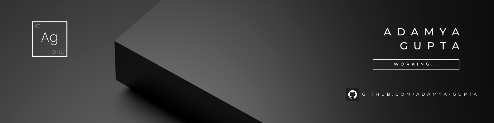

  

  

  

## 👋 About Me
💡 **Philosophy**: <i> "I would rather shine like silver than be kept as gold."</i>    
🌟 **Mission**: Inspired by open source - contributing to make technology accessible for everyone.  
🚀 **Focus**: Full Stack Development, Cloud Technologies, and DSA. 

## 💻 Tech Stack
| Category                   | Technologies |
|---------------------------|--------------|
| 🚀 Programming Languages   |     |
| 🌐 Frontend Development    |      |
| ⚙️ Backend Development     |       |
| ☁️ Cloud & Deployment      |     |
| 🗄️ Databases              |    |
| 🤖 AI/ML & Data Science    |      |
| 🛠️ Tools & DevOps         |       |
|  🖥️ Operating Systems        |         |

<!--## 📊 GitHub Stats:

  
   
  

-->

## 📈 Contribution Graph:

  

## 📫 Connect with Me:

  

  

  <i>Let's build something amazing together!</i>

