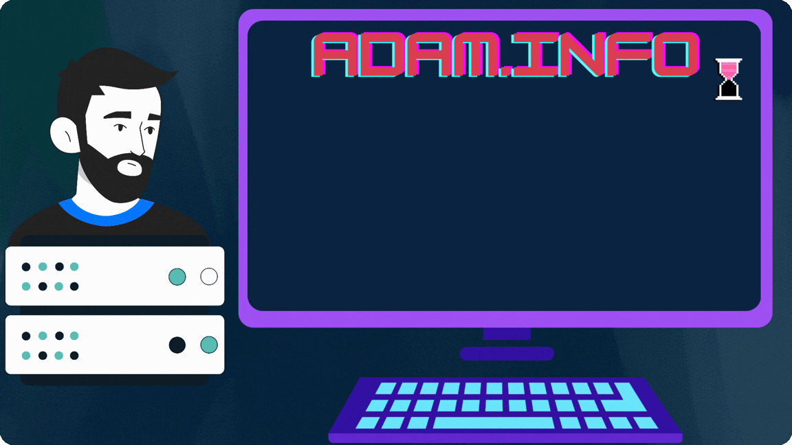
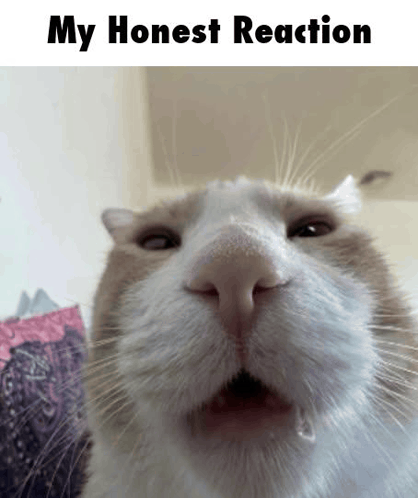
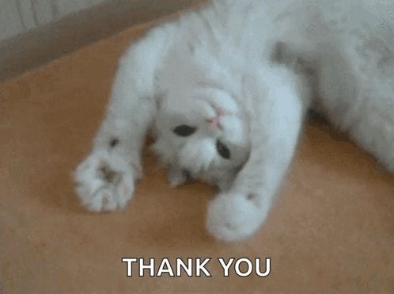

<!--
If you're reading this, you are one of the curious ones.

Most people only see the surface, but you decided to look deeper. 

Don't stop here. Take a closer look at the visual assets kept on display. 

Keep your eyes open. You might find far more than you expected.

yvlxp://wqjup.xnw/JgE1lBZnWpvaPEbM6
-->

<picture>
  <source media="(prefers-color-scheme: dark)" srcset="./Assets/Info-blue.gif">
  <source media="(prefers-color-scheme: light)" srcset="./Assets/Info-white.gif">
  
  
</picture>

 

  

  

## 👨‍💻 About me
- I believe in keeping things simple, direct, and honest. I respect people who think critically, speak their minds, and get straight to the point.

- Give me a problem, enough time, and the right resources, and I'll probably find a way to solve it. I'm not particularly attached to a specific tech stack either - if something needs to be built with a technology I don't know, I'll learn it and get it done. Adaptability is probably one of my strongest qualities.

- Outside of coding, I like debating different ideas and topics. I enjoy challenging assumptions, exploring different perspectives, and having conversations where people actually bring something to the table.

## 💻 Tech Stack

  

## 📫 Contact

  

  
   <i> Let's build something amazing together! </i> [😃](https://youtu.be/dQw4w9WgXcQ?si=_sDEwCjTkSaSHOYG)

